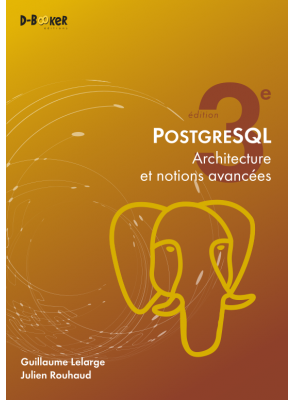

Remerciements
=============

Cette documentation est le prolongement naturel du chapitre sur les nœuds
d'exécution de mon livre "PostgreSQL - Architecture et notions avancées", dont
il reprend une partie. Ce livre, paru aux éditions D-BookeR, en est à sa
troisième édition et couvre la version 12 de PostgreSQL. `Il est disponible ici
<https://www.d-booker.fr/postgresql3e/621-architecture-et-notions-avancees-3ed.html>`_.

La rédaction de cette documentation se fait sur mon temps libre ainsi que sur
le temps que me laisse prendre `Dalibo <https://dalibo.com/>`_, la société qui
m'emploie. Merci à eux.

.. image:: images/logo-dalibo.png
  :alt: Logo Dalibo

